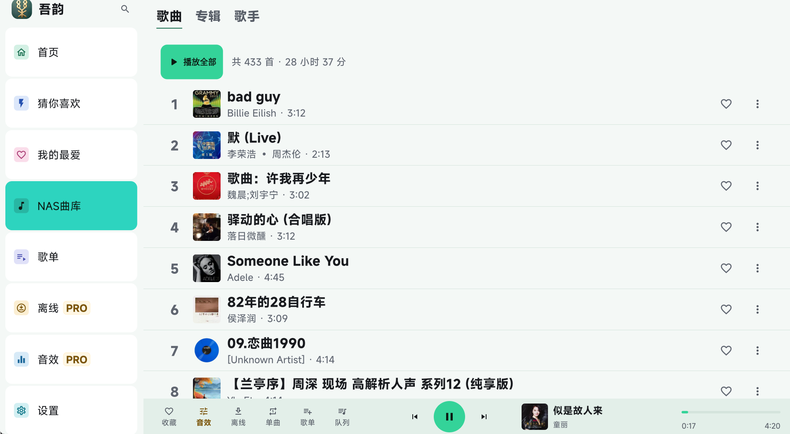
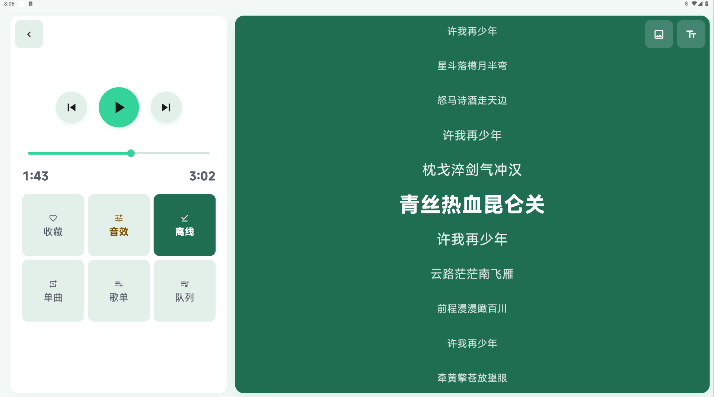
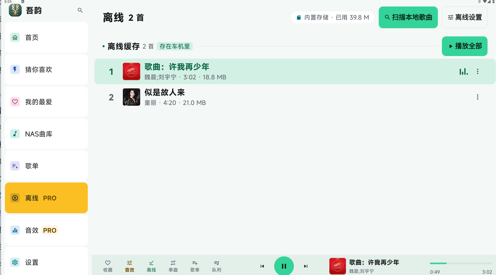
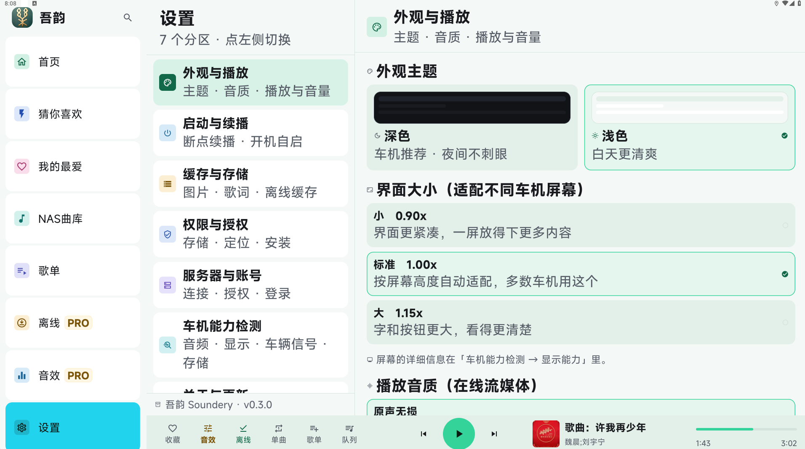

  

  # 吾韵 Soundery

  **车机横屏 Navidrome 音乐客户端**

  把家里 NAS 上的歌，带到车上好好听。

  [官网](https://soundery.cn) · [下载](https://soundery.cn/download.html) · [使用教程](https://soundery.cn/tutorial/)

  
  
  
  

---

## 这是什么

**吾韵 Soundery** 是一款为 **Android 车机横屏**打造的 Navidrome 音乐客户端。

它解决的问题很简单：**你在家里 NAS（Navidrome）上存了很多歌，但车机上没有一款好用的播放器去听它们。**

市面上的 NAS 音乐客户端，大多是为手机竖屏或桌面设计的——搬到车机上，要么界面挤成一团，要么翻歌要找好几层，要么根本没有歌词。吾韵就是为了补上这一环。

> **家 NAS 里的歌，在车上好好听。**

---

## 核心能力

### ① 连接你自己的音乐库

- 连接自建 **Navidrome** 服务器（兼容 Subsonic / OpenSubsonic 协议）
- 音乐完全在你自己的 NAS 上，没有推荐算法绑架，没有广告
- 按艺术家 / 专辑 / 歌单 / 收藏浏览，支持全局搜索

### ② 把歌带到车上

- **U 盘扫描**：插上 U 盘即可播放，**U 盘里的歌也有歌词**（原厂车机基本做不到）
- **离线下载**：整曲与歌词离线到本地，隧道、野外、无网环境照样听
- **内网穿透适配**：配合公网 IP / IPv6 / P2P 打洞，车在外面也能连回家里的 NAS

### ③ 为车机大屏重新设计

- **多比例自适应**：8:3（1920×720）宽屏 / 16:9 常规屏 都能用，布局自动分列
- **歌词当前行居中**：同步歌词（LRC）滚动显示，当前唱到的那一句始终在正中央
- **歌词字号可调**：歌词视图右上角双 T 图标，三档字号随时切换
- **界面缩放三档**：0.90x / 1.00x / 1.15x

### ④ 开车的安全（这是给"车里用的"和"给手机用的"最大区别）

- **停车提示**：行车中弹窗自动挡掉，需要操作的功能先停下来再说
- **定位不采集、不上传**：设置页明确标注用途与数据边界
- **车机能力检测**：检测音频 / 显示 / 车辆信号 / 存储能力，按车机实际情况适配

### 其他

- 同步歌词（LRC，自动缓存到本地）
- 智能推荐（基于你的播放与收藏习惯，全部来自你自己的曲库）
- Pro 音效中心：重低音、全景环绕、人声增强、电音动感、5 段均衡器
- 开机自启 · 断点续播 · 缓存管理
- 音频焦点适配（导航播报、蓝牙电话自动避让）

---

## 界面预览

### 首页 · 8 导航 + 常驻播放条

### NAS 曲库

### 播放页 · 宽屏 8:3 三栏布局（左控制 / 中歌词 / 右封面）

### 播放页 · 16:9 双列布局（同一套界面自动适配）

### 歌词字号三档可调

| 小 | 中 | 大 |
|---|---|---|
|  |  |  |

### 离线下载

### 设置 · 分区管理

---

## 快速开始

### 1. 准备一个 Navidrome 服务器

如果你还没有，先在家里 NAS 上部署 Navidrome（Docker 或群晖套件均可）：

👉 **[NAS 部署 Navidrome + 内网穿透 · 小白教程](https://soundery.cn/tutorial/)**

### 2. 下载吾韵 Soundery

👉 **[前往官网下载](https://soundery.cn/download.html)**（安装包约 55 MB，Android 9.0+）

### 3. 在车机上登录

在吾韵里填入你的 Navidrome 地址与账号密码即可：

| 场景 | 填什么 |
|---|---|
| 家里（同一局域网） | NAS 的内网 IP，如 `192.168.1.100:4533` |
| 车在外面 | 你配置好的穿透地址（公网 IP / 域名 / 100.x.x.x） |

详细步骤见 [使用教程](https://soundery.cn/tutorial/guide-step4-login.html)。

---

## 常见问题

<b>连不上，提示连接失败？</b>

按顺序排查：① 确认 NAS 上 Navidrome 容器在运行；② 确认端口 4533 正确；③ 家里用内网 IP、外面用穿透地址；④ 若用 P2P 打洞，检查两台设备是否都登录在线。

<b>扫描后有些歌没显示？</b>

通常是格式不支持或标签缺失。建议用 MP3 / FLAC，并用 MusicBrainz Picard、MP3tag 等工具补全歌名和歌手信息。

<b>公网 IP、IPv6、P2P 打洞怎么选？</b>

能申请公网 IP 就选它（最快）；没有就看车机有没有 IPv6，有就用 IPv6 + DDNS；都不行用 P2P 打洞（节点小宝 / Tailscale / ZeroTier），几乎任何环境都能用。

<b>能在手机上用吗？</b>

**暂时不支持。** 吾韵目前只针对**车机屏幕**做了界面适配；手机能登录但界面没有适配、显示会乱。等完成手机端适配后会更新。

着急用手机在外面听，可以装一个支持 Navidrome 协议的第三方手机播放器，填同样的服务器地址和账号密码即可。

更多问题见 [FAQ 页](https://soundery.cn/tutorial/guide-faq.html)。

---

## 关于收费

- **基础播放功能永久免费**
- **Pro 权益（离线下载、音效中心等）目前全部赠送**

一次开通，无订阅、无广告、无隐藏收费。

---

## 关于本仓库

本仓库用于**产品介绍与文档**，暂不包含源代码。

| | |
|---|---|
| 官网 | https://soundery.cn |
| 下载 | https://soundery.cn/download.html |
| 使用教程 | https://soundery.cn/tutorial/ |
| 常见问题 | https://soundery.cn/tutorial/guide-faq.html |
| 隐私政策 | https://soundery.cn/privacy.html |
| 开发与运营 | 潍坊茂德邦久经贸有限公司 |

---

## 相关项目

- [**Navidrome**](https://www.navidrome.org/) —— 开源音乐服务器（吾韵连接的服务端）
- [Subsonic API](https://www.subsonic.org/pages/api.jsp) —— 吾韵兼容的协议标准

---

**吾韵 Soundery** · 车机音乐播放器 · 让 NAS 里的歌在车上好好听

[鲁ICP备2026052104号-1](https://beian.miit.gov.cn/) · [鲁公网安备37070202000712号](https://beian.mps.gov.cn/#/query/webSearch?code=37070202000712)

